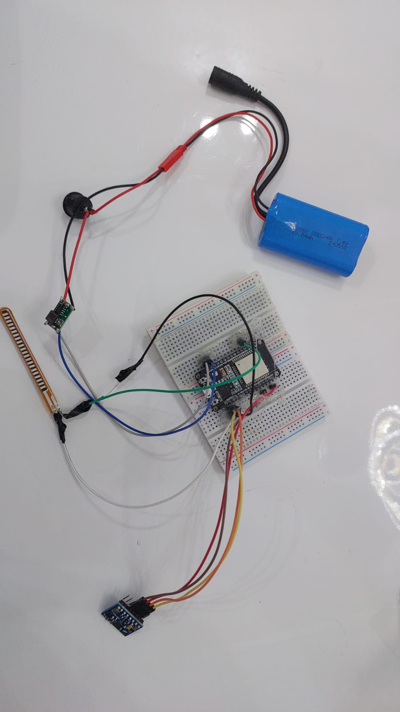
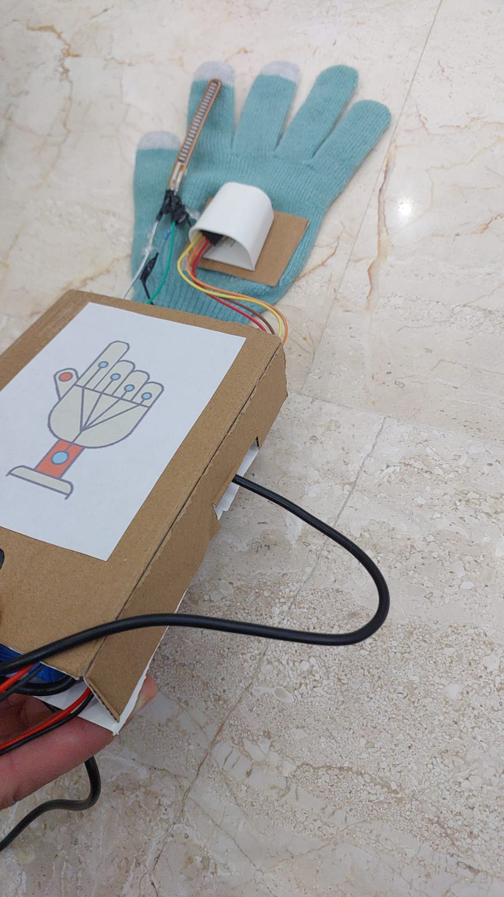

# ESP32 Gesture-Controlled Gaming Glove

A wearable gesture-based gaming controller built using:

- ESP32
- MPU6050 (accelerometer + gyroscope)
- Flex sensor
- Python bridge
- Unity game integration

This project allows real-time hand gestures to control player movement and shooting inside a Unity game.

---

##  System Architecture

→ ESP32 (MPU6050 + Flex Sensor)  
→ UDP transmission  
→ Python bridge (`serial_reader.ipynb`)
→ `serial_output.txt`
→ Unity reads gesture data  
→ Player movement + shooting

---

## 📁 Repository Structure
```
/
├── unity/
│   ├── Scripts/
│   │   ├── RigidbodyFirstPersonController.cs
│   │   ├── SerialController.cs
│   │   └── Wepon.cs
│   
├── python/
│   └── serial_reader.ipynb
│
├── arduino/
│   └── esp32_glove.ino
│
└── Docs/
    ├── Gesture controlled gaming glove.pdf
    ├── Gesture controlled gaming glove.pptx
    ├──  glove_prototype_circuit.jpeg
    └──  glove_wearable.jpeg
```
---
## Development Process

1. Hardware prototyping on breadboard  
2. Sensor calibration and data validation  
3. UDP transmission testing  
4. Unity integration and gameplay mapping  
5. Wearable enclosure design
   
---

## 🔌 Circuit / Wiring Prototype

Below is the physical prototype of the gesture-controlled glove system:

<p align="center">
  
</p>

### Components:
- ESP32 microcontroller mounted on breadboard
- MPU6050 (I2C motion sensor)
- Flex sensor (analog input)
- 7.4V Li-ion battery
- Step-down voltage regulator
- 47kΩ resistor (flex sensor voltage divider)

The system operates wirelessly via Wi-Fi (UDP communication).

---

## 🧤 Final Wearable Design
After validating the electronics, the system was integrated into a wearable form factor.
<p align="center">
  
</p>

The final prototype integrates the sensors into a wearable glove:
- Flex sensor mounted along the finger
- MPU6050 positioned on the back of the hand
- ESP32 and battery enclosed in a portable housing
- Fully wireless operation via Wi-Fi
  
This design enables natural hand gestures to control in-game movement and shooting.

---

## 🎮 Base Game Project (Credits)

This work is built on top of the open-source Unity project:

**Zomboid Survival (original game repo):**  
https://github.com/saivittalb/zomboid-survival

All rights and credit for the original game project go to its author(s).  
This repo only includes the scripts I modified/added for gesture control input.

---


## 📁 What I Added / Modified 

### ✅ Added
1) `Assets/StreamingAssets/SerialController.cs`  
- Reads gesture data from `serial_output.txt`
- Parses values and exposes them for the player controller scripts

---

### ✅ Modified
2) `RigidbodyFirstPersonController.cs`  
Path: Assets/Asset Packs/Standard Assets/Characters/FirstPersonCharacter/Scripts

- Movement input is driven by glove gesture values instead of keyboard WASD
- Reads forward/back motion from the data file 
- Applies a dead zone / threshold to prevent drifting

3) `Wepon.cs`
Path: Assets/Scripts

- Modified to allow shooting based on glove trigger input (flex sensor)
- Connects gesture-based shoot signal to in-game weapon firing logic

---
### 📄 Data File

The Python notebook (`serial_reader.ipynb`) continuously writes sensor data to:

`serial_output.txt`

Unity reads this file at runtime to update movement, rotation, and shooting behavior.

---

## ▶️ How To Use These Scripts in Your Copy of the Game

### 1) Clone the original game
Clone the original game repo from:
https://github.com/saivittalb/zomboid-survival

Open it in Unity.

---

### 2) Add the StreamingAssets + SerialController
Create this folder :
Assets/StreamingAssets/

Copy in:
- `SerialController.cs`
---

### 3) Replace the controller scripts
Replace these scripts in your Unity project with the modified versions from this repo:

- `RigidbodyFirstPersonController.cs`
- `Wepon.cs`

Make sure they are placed in the same paths as in the original project.

---

### 4) Run order 
1. Upload `esp32_glove.ino` to the ESP32 
2. Run the Python script (it should update `serial_output.txt` continuously)  
3. Press Play in Unity

---

##  Gesture Mapping

Typical mapping used:
- **Tilt forward/back (MPU6050 Y-axis)** → move forward/backward
- **Rotate hand left/right (MPU6050 Z-axis)**  → turn left/right
- **Finger bend (flex sensor threshold)** → shoot

---
